# issun-analyzer

Static analysis tool for ISSUN EventBus and Hook systems.

## Overview

`issun-analyzer` is a Rust static analysis library that extracts and visualizes the structure of event-driven plugin systems. It analyzes:

- **Event Flow**: Event subscriptions (`EventReader<E>`) and publications (`EventBus::publish<E>()`)
- **Hook Traits**: Hook trait definitions, method signatures, and categorization
- **System Structure**: System implementations and their dependencies
- **Plugin Architecture**: Plugin directory structure and relationships

## Features

### Phase 1-3: Analysis (Completed)

- ✅ **Event Extraction**: Detect event subscriptions and publications
- ✅ **System Analysis**: Extract system implementations and field dependencies
- ✅ **Plugin Inference**: Infer plugin structure from directory layout
- ✅ **Hook Analysis**: Analyze hook traits and categorize methods by naming convention
  - Notification hooks: `on_*`
  - Validation hooks: `can_*`
  - Lifecycle hooks: `before_*`, `after_*`
  - Calculation hooks: `calculate_*`
  - Generation hooks: `generate_*`

### Phase 4: Graph Generation (Completed)

- ✅ **Event Flow Graphs**: Visualize event publish/subscribe relationships
- ✅ **Hook Flow Graphs**: Display hook trait dependencies
- ✅ **Combined Graphs**: Unified view of events and hooks
- ✅ **Mermaid Format**: Generate `.mmd` files for https://mermaid.live

### Phase 5: Validation (Completed)

- ✅ **Unused Event Detection**: Find events published but never subscribed
- ✅ **Missing Publisher Detection**: Find events subscribed but never published
- ✅ **Duplicate Subscription Detection**: Detect duplicate event subscriptions
- ✅ **Event Loop Detection**: Identify potential circular dependencies using DFS

## Installation

Add to your `Cargo.toml`:

```toml
[dependencies]
issun-analyzer = { path = "crates/issun-analyzer" }
```

## Usage

### Example: Analyze Event Flow

```rust
use issun_analyzer::prelude::*;
use std::path::PathBuf;

let analyzer = Analyzer::new(".");
let mut result = AnalysisResult::new();

// Analyze a system file
let system_path = PathBuf::from("crates/issun/src/plugin/combat/system.rs");
let file_analysis = analyzer.analyze_file(&system_path)?;
result.add_file(file_analysis);

// Print subscriptions
for sub in result.all_subscriptions() {
    println!("System {} subscribes to {}", sub.subscriber, sub.event_type);
}
```

### Example: Generate Event Flow Graph

```rust
use issun_analyzer::prelude::*;

let graph_gen = EventFlowGraphGenerator::new(&result);
let mermaid_graph = graph_gen.generate();

std::fs::write("event_flow.mmd", mermaid_graph)?;
println!("Graph saved! View at https://mermaid.live");
```

### Example: Validate Event Consistency

```rust
use issun_analyzer::prelude::*;

let validator = Validator::new(&result);
let validation = validator.validate();

validation.print_report();

if validation.has_high_severity_warnings() {
    println!("⚠️ High severity warnings found!");
}
```

## Examples

Run the included examples from the project root:

```bash
# Analyze Combat plugin events
cargo run -p issun-analyzer --example analyze_combat

# Analyze all systems
cargo run -p issun-analyzer --example analyze_systems

# Analyze all plugins
cargo run -p issun-analyzer --example analyze_plugins

# Analyze hooks in detail
cargo run -p issun-analyzer --example analyze_hooks

# Generate event flow graph
cargo run -p issun-analyzer --example generate_event_flow

# Generate hook flow graph
cargo run -p issun-analyzer --example generate_hook_flow

# Generate combined event + hook graph
cargo run -p issun-analyzer --example generate_combined_flow

# Validate event flow consistency
cargo run -p issun-analyzer --example validate_event_flow
```

## Graph Output Examples

### Event Flow Graph

```mermaid
flowchart TD
    CombatStartRequested["📨 CombatStartRequested"]
    style CombatStartRequested fill:#e1f5ff
    process_start_requests["process_start_requests"]
    CombatStartRequested -->|subscribe| process_start_requests
```



### Hook Flow Graph

```mermaid
flowchart TD
    subgraph combat["combat Plugin"]
        combat_CombatSystem["⚙️ CombatSystem"]
        combat_CombatHook["🪝 CombatHook"]
        style combat_CombatHook fill:#fff4e6
        combat_CombatSystem -.->|uses| combat_CombatHook
        combat_CombatHook_methods["📋 5 methods (3 notif, 1 valid)"]
        combat_CombatHook -.-> combat_CombatHook_methods
    end
```



## Validation Warnings

The validator reports three severity levels:

- 🔴 **High**: Potential event loops (circular dependencies)
- 🟡 **Medium**: Missing publishers (events with no source)
- 🟢 **Low**: Unused events, duplicate subscriptions

Example output:

```
⚠️  Validation Warnings (2)

🟡 Medium Severity (1):
⚠️  Event 'FooEvent' is subscribed but never published
   Subscribers: SystemA, SystemB

🟢 Low Severity (1):
⚠️  Event 'BarEvent' is published but never subscribed
   Publishers: SystemC
```

## Architecture

```
issun-analyzer/
├── src/
│   ├── analyzer.rs          # Core analysis orchestration
│   ├── event_extractor.rs   # Event subscription/publication extraction
│   ├── system_extractor.rs  # System implementation analysis
│   ├── plugin_extractor.rs  # Plugin directory structure inference
│   ├── hook_extractor.rs    # Hook trait analysis
│   ├── graph_generator.rs   # Mermaid graph generation
│   ├── validator.rs         # Event flow validation
│   ├── types.rs             # Core data structures
│   └── error.rs             # Error types
└── examples/
    ├── analyze_combat.rs
    ├── analyze_systems.rs
    ├── analyze_plugins.rs
    ├── analyze_hooks.rs
    ├── generate_event_flow.rs
    ├── generate_hook_flow.rs
    ├── generate_combined_flow.rs
    └── validate_event_flow.rs
```

## Testing

```bash
cargo test -p issun-analyzer
```

Current test coverage:
- 15 unit tests (all passing)
- Event extraction tests
- System extraction tests
- Plugin inference tests
- Hook analysis tests
- Graph generation tests
- Validation tests

## Roadmap

- [x] Phase 0: Project setup
- [x] Phase 1: Event analysis (EventReader, publish detection)
- [x] Phase 2: System/Plugin structure inference
- [x] Phase 3: Hook analysis (trait extraction, categorization)
- [x] Phase 4: Graph generation (Mermaid format)
- [x] Phase 5: Validation (unused events, loops, consistency)
- [ ] Phase 6: CLI tool (separate crate)

## Limitations

- **Dynamic Dispatch**: Cannot see custom hook implementations (`Arc<dyn Hook>`)
- **Runtime Behavior**: Cannot analyze runtime-conditional event publishing
- **Non-turbofish Publish**: `bus.publish(event)` without `::<Type>` is not detected
- **Macro Expansion**: Complex proc macros may require manual expansion

## Use Cases

- **Large Projects**: Understand event flow in projects with 10+ plugins
- **Onboarding**: Help new developers understand system interactions
- **Refactoring**: Identify coupling and dependencies before changes
- **Documentation**: Auto-generate architecture diagrams
- **CI/CD**: Validate event consistency in pull requests

## License

This project is part of the ISSUN game framework.
