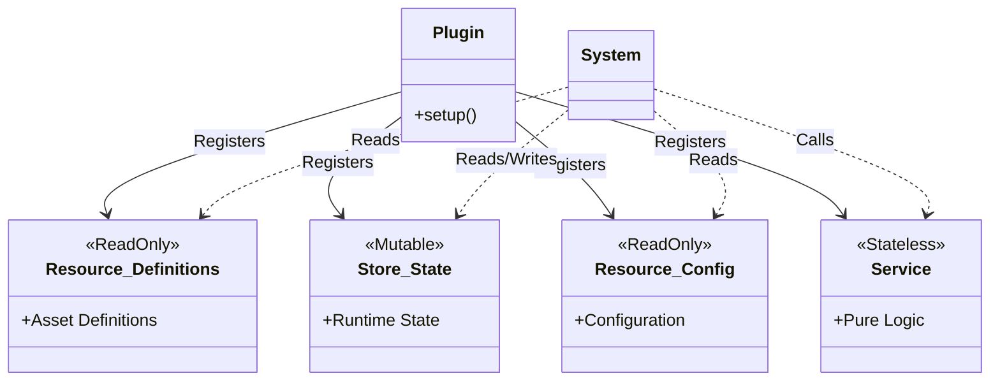

# Plugin Design Principles

**Date**: 2025-11-21
**Status**: Accepted
**Context**: Discovered design flaws in the Registry pattern and established correct design principles.

---

## Background of the Problem

### Design Flaws in Registry

Currently, many Plugins use a `Registry` that encapsulates everything:

```rust
// ❌ Problematic Pattern
pub struct PolicyRegistry {
    policies: HashMap<PolicyId, Policy>,  // Definitions (ReadOnly)
    active_policy_id: Option<PolicyId>,   // State (Mutable)
    config: PolicyConfig,                 // Configuration (ReadOnly)
}
```

**Issues**:
1.  **Mixed Responsibilities** - Definitions, State, and Configuration are not separated.
2.  **Store.rs Unused** - Existing Store infrastructure is not being utilized.
3.  **Bloated State** - ReadOnly definitions are treated as managed state.
4.  **Misuse of Resource** - Registered as a Resource, but actually updated/mutable.

### Root Cause

- `Registry` was created without deep consideration when splitting `GameContext`.
- The name "Register" led to a design that encapsulates everything.
- No distinction between Asset definitions and Runtime state.

---

## Correct Design Principles

### Architecture Overview



### Data Types and Storage Locations

| Data Type | Storage Location | Mutability | Example |
|---|---|---|---|
| **Asset/Config Definitions** | `Resource<BuiltinDefinitions>` | ReadOnly | Policy Definitions, Territory Definitions |
| **Runtime State** | `Store<State>` | Mutable | active_policy_ids, control values |
| **Dynamically Generated Entities** | `Repository<CustomDefinitions>` | Mutable | Custom Policies, Save Data |
| **Configuration** | `Resource<Config>` | ReadOnly | aggregation_strategies |

### Core Design Concepts

1.  **Asset/Config Definitions = ReadOnly**
    - Loaded at game startup (JSON, Rust definitions, API).
    - Not changed within the Plugin.
    - Accessible from other Plugins (via Resources).

2.  **Runtime State = Mutable but Minimized**
    - Only things that truly change based on user operations.
    - Managed using `Store`.
    - Kept as small as possible to reduce bugs.

3.  **Repository only when necessary**
    - When implementing Save/Load features.
    - When implementing Network Synchronization.
    - Basically, `Store` is sufficient.

### External State Change Coordination

| Method | Timing | Transaction | Usage |
|---|---|---|---|
| **Hook** | Synchronous with State change | Full Tx (Rollbackable) | Validation, Side effects, Calculation |
| **Event** | Asynchronous after State change | Not Rollbackable | Notifications, Logs, UI Updates |

---

## Implementation Patterns

### ✅ Correct Implementation (PolicyPlugin Example)

```rust
// 1. Builtin Definitions (Resource, ReadOnly)
#[derive(Resource)]
pub struct PolicyDefinitions {
    policies: HashMap<PolicyId, Policy>,
}

impl PolicyDefinitions {
    pub fn get(&self, id: &PolicyId) -> Option<&Policy> {
        self.policies.get(id)
    }

    pub fn query_by_tag(&self, tag: &str) -> Vec<&Policy> {
        self.policies.values()
            .filter(|p| p.tags.contains(tag))
            .collect()
    }

    pub fn all(&self) -> impl Iterator<Item = &Policy> {
        self.policies.values()
    }
}

// 2. Runtime State (Store, Mutable)
pub type PolicyState = Store<String, PolicyStateEntry>;

#[derive(Clone)]
pub struct PolicyStateEntry {
    pub active_policy_ids: Vec<PolicyId>,
}

// 3. Configuration (Resource, ReadOnly)
#[derive(Resource)]
pub struct PolicyConfig {
    pub allow_multiple_active: bool,
    pub aggregation_strategies: HashMap<String, AggregationStrategy>,
}

// 4. Service (Stateless Calculation)
pub struct PolicyService;

impl PolicyService {
    pub fn aggregate_effects(
        policies: &[&Policy],
        strategies: &HashMap<String, AggregationStrategy>,
        default_strategy: AggregationStrategy,
    ) -> HashMap<String, f32> {
        // Pure function calculation logic
    }
}

// 5. Plugin setup (with derive macro - recommended)
#[derive(Plugin)]
#[plugin(name = "issun:policy")]
pub struct PolicyPlugin {
    #[plugin(skip)]
    hook: Arc<dyn PolicyHook>,
    #[plugin(resource)]
    config: PolicyConfig,
    #[plugin(resource)]
    policies: Policies,
    #[plugin(runtime_state)]
    state: PolicyState,
    #[plugin(system)]
    system: PolicySystem,
}

impl PolicyPlugin {
    pub fn new() -> Self {
        let hook = Arc::new(DefaultPolicyHook);
        Self {
            hook: hook.clone(),
            config: PolicyConfig::default(),
            policies: Policies::new(),
            state: PolicyState::new(),
            system: PolicySystem::new(hook),
        }
    }

    pub fn with_hook<H: PolicyHook + 'static>(mut self, hook: H) -> Self {
        let hook = Arc::new(hook);
        self.hook = hook.clone();
        self.system = PolicySystem::new(hook);
        self
    }

    pub fn with_policies(mut self, policies: Policies) -> Self {
        self.policies = policies;
        self
    }

    pub fn with_config(mut self, config: PolicyConfig) -> Self {
        self.config = config;
        self
    }
}

// Note: The derive macro automatically generates the Plugin trait implementation
// that registers all annotated fields appropriately

// 6. Usage in System
fn policy_activation_system(ctx: &Context) {
    let definitions = ctx.resources.get::<PolicyDefinitions>().unwrap();
    let mut state = ctx.resources.get_mut::<PolicyState>().unwrap();
    let config = ctx.resources.get::<PolicyConfig>().unwrap();

    // Reference definitions, update state
    if let Some(policy) = definitions.get(&policy_id) {
        let entry = state.get_mut("global").unwrap();
        if config.allow_multiple_active {
            entry.active_policy_ids.push(policy.id.clone());
        } else {
            entry.active_policy_ids = vec![policy.id.clone()];
        }

        // Emit Event (Asynchronous Notification)
        events.send(PolicyActivatedEvent { id: policy_id });
    }
}
```

### When Dynamic Generation is Needed (Custom Policy)

```rust
// Repository (Mutable, Save Target)
pub struct CustomPolicyRepository {
    custom_policies: HashMap<PolicyId, Policy>,
}

impl CustomPolicyRepository {
    pub fn save(&self) -> Result<(), SaveError> {
        // Save to File/DB
    }

    pub fn load() -> Result<Self, LoadError> {
        // Load from File/DB
    }
}

fn custom_policy_creation_system(ctx: &mut Context) {
    let mut repo = ctx.resources.get_mut::<CustomPolicyRepository>().unwrap();

    // Created by user during game
    let custom = Policy::new("custom_1", "My Policy", "...")
        .add_effect("income_multiplier", 1.5);

    repo.insert(custom.id.clone(), custom);
}
```

---

## Responsibilities of Each Layer

### Resource (Read-Only)

- **Asset Definitions**: Builtin Policies, Territory Definitions
- **Config**: Settings, Aggregation Strategies
- **Principle**: Registered at Plugin setup, not changed afterwards.

### Store (Runtime State)

- **State**: active_policy_ids, control values
- **Principle**: Keep minimal, only what truly changes.

### Repository (Persistence)

- **Dynamic Entities**: Custom Policies, Save Data
- **Principle**: Implement only when needed (InMemory = Store is often sufficient).

### Service (Calculation Logic)

- **Stateless**: Pure functions
- **Principle**: Holds no state, receives data via arguments.

---

## Migration Strategy

### Phased Refactoring

1.  **Phase 1: Create Design Document** ✅
    - Document correct design principles.

2.  **Phase 2: Start with Simple Plugins**
    - Plugins with little state (Reputation, Territory).
    - Separate Registry → Definitions + State + Config.

3.  **Phase 3: Migrate Complex Plugins**
    - Plugins with much state (Policy, Research).
    - Service layer is already implemented.

4.  **Phase 4: New Plugins**
    - Implement with correct design from the start.
    - Refer to as best practice.

### Refactoring Checklist

- [ ] Analyze Registry (Identify Definitions/State/Config)
- [ ] Create BuiltinDefinitions (ReadOnly)
- [ ] Implement State with Store (Mutable, Minimized)
- [ ] Register Config to Resource (ReadOnly)
- [ ] Update System (Access via Resources)
- [ ] Update Tests
- [ ] Update Documentation

---

## FAQ

### Q: Should Registry be completely abolished?

**A**: Yes. Registry is unnecessary as an intermediate layer.
Separate directly into:
- Definitions → `Resource<BuiltinDefinitions>`
- State → `Store<State>`
- Configuration → `Resource<Config>`

### Q: Store vs Repository?

**A**:
- **Store**: InMemory, only during game execution (like Redis/Memcache).
- **Repository**: Persistent, Save/Load/Net Sync (like Postgres).

Basically, `Store` is sufficient. `Repository` only when needed.

### Q: Are Resources mutable?

**A**: No (in principle).
Resources are assumed to be ReadOnly as Asset/Config.
State that changes at runtime should be stored in `Store`.

### Q: Can other Plugins reference the state?

**A**: Yes.
Since everything is registered in Resources, it can be freely accessed from other Plugins.
This is the flexibility of the `issun` design.

---

## Reference: Status of Existing Plugins

### Service Layer Implemented (Logic Separated)

- ✅ PolicyService
- ✅ FactionService
- ✅ ResearchService
- ✅ TerritoryService
- ✅ ReputationService

### Registry Separation Needed

- ❌ PolicyRegistry → Definitions + State + Config
- ❌ FactionRegistry → Definitions + State + Config
- ❌ ResearchRegistry → Definitions + State + Config
- ❌ TerritoryRegistry → Definitions + State + Config
- ❌ ReputationRegistry → Definitions + State + Config

---

## Summary

**Core Design**:

1.  **Separate Definitions and State** - Do not mix ReadOnly definitions into State.
2.  **Minimize State** - Only what changes, to reduce bugs.
3.  **Utilize Store** - Use existing infrastructure.
4.  **Coordinate via Resource** - Freely accessible from other Plugins.

**The True Nature of Registry**:

- An intermediate layer mixing Definitions (ReadOnly) + State (Mutable) + Config (ReadOnly).
- Created without deep thought during GameContext split.
- **Unnecessary**.

**Next Steps**:

1.  Step-by-step refactoring starting from simple Plugins.
2.  Implement new Plugins with correct design from the start.
3.  Service layer is already complete, so only Registry separation remains.
